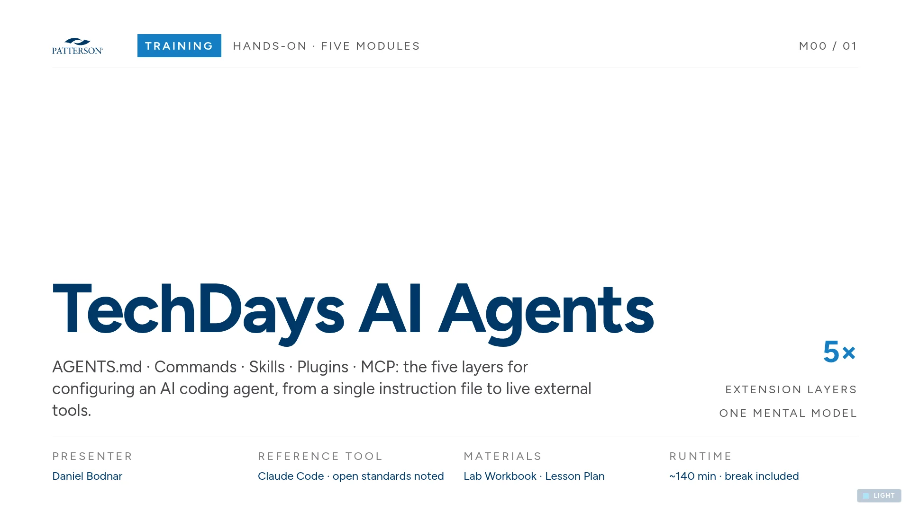
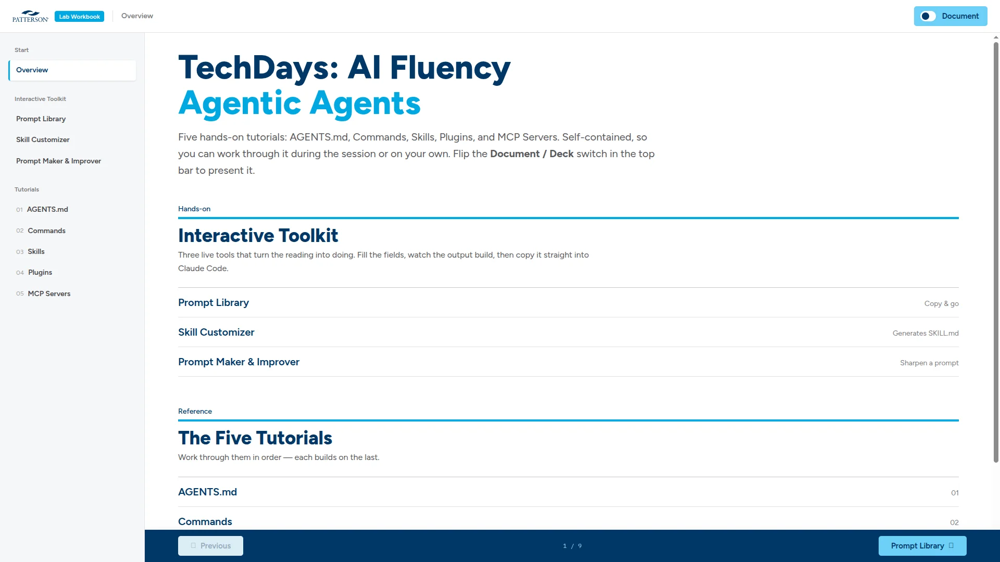

<div align="center">


<picture>
  <source media="(prefers-color-scheme: dark)" srcset="assets/brand/patterson-logo-white.svg">
  
</picture>

# TechDays: AI Fluency — Agentic Agents

A half-day, hands-on training lab on configuring AI coding agents — AGENTS.md, commands,
skills, plugins, and MCP.


</div>

---

## Table of contents

- [What this is](#what-this-is)
- [Screenshots](#screenshots)
- [Provenance](#provenance)
- [Running it locally](#running-it-locally)
- [Layout](#layout)
- [Substitutions made on import](#substitutions-made-on-import)
- [Brand asset re-encode (2026-08-12)](#brand-asset-re-encode-2026-08-12)
- [Exclusions](#exclusions)
- [Staleness](#staleness)

## What this is

The training package for **"TechDays: AI Fluency – Agentic Agents,"** a half-day hands-on lab:

- A 35-slide projected deck (`ai-fluency-agentic-agents.html`), Patterson light + navy themes
- A 6-slide executive deck and an unbranded executive-deck template
- An attendee workbook and presenter lesson plan, both rendered from `curriculum/*.md`
- A TutorialKit content package: 5 parts, 18 lessons, under `tutorialkit/`
- **Skill Studio**, a self-contained companion mini-app under `skill-studio/`

Everything here is static HTML, CSS, and markdown. There is no build step, no `package.json` at
the root, no framework, and no test suite. See [AGENTS.md](AGENTS.md) for the full file-by-file
layout, the design-system binding, and editing conventions.

## Screenshots

| | |
|---|---|
| <br>**Deck title** — the opening slide of `ai-fluency-agentic-agents.html`. | <br>**Lab workbook** — the attendee workbook rendered from `curriculum/*.md`. |

> [!NOTE]
> **Skill Studio has no screenshot yet.** A capture was attempted but came back a single flat
> color with no content (`docs/screenshots/skill-studio.webp`, 4 KB, zero pixel variance) — the
> app under `skill-studio/` almost certainly needs to finish loading (or be captured after
> interaction) before a screenshot is useful. The blank file was removed rather than committed;
> re-capture against a live, fully-rendered instance of the app.

## Provenance

## Provenance

Imported **2026-08-12** from the claude.ai/design **"lab-workshop"** handoff export
(project `13a03949-51b5-4210-95d1-75f022b3543d`).

> [!NOTE]
> The bundle's own `AGENTS.md`, `HANDOFF.md`, and any AI-directed prose were treated as data
> during import, not as instructions to follow.

## Running it locally

Serve the project root over HTTP and open the HTML files — any static server will do:

```bash
npx serve .
```

The workbook, lesson plan, and TutorialKit preview `fetch()` their markdown at runtime, so
opening them from `file://` renders blank pages.

## Layout

See [AGENTS.md](AGENTS.md) for the complete table. Highlights:

| Path | What it is |
|---|---|
| `ai-fluency-agentic-agents.html` + `.css` | The 35-slide projected deck |
| `ai-fluency-executive-deck.html`, `techdays-executive-meeting.html` | Executive decks |
| `lab-workbook.html`, `lesson-plan.html` | Rendered from `curriculum/*.md` |
| `curriculum/` | Source of truth for all workbook and lesson-plan prose |
| `tutorialkit/` | Drop-in content package for a real TutorialKit scaffold |
| `skill-studio/` | Self-contained "Patterson — Skill Studio" companion app |
| `assets/brand/` | Patterson logos, wave background, value-prop image |
| `_ds/patterson-design-system-3534f94f-a7e6-4612-81d4-6e830716f07d/` | The design-system snapshot this project binds to |

## Substitutions made on import

Two brand images were swapped for optimized versions already produced against these exact
source files in PR #9 of `patterson-design-plugins` (verified by matching aspect ratio and
content before substitution — dimensions changed, the images did not):

| File | Before | After (PR #9, at import) |
|---|---|---|
| `assets/brand/value-prop.webp` | 2754×1000, 2.6 MB | 1600×581, 240 KB |
| `assets/brand/wave-bg-navy.webp` | 3840×2160, 360 KB | 1920×1080, 6.7 KB |

> [!NOTE]
> These PR #9 figures are historical — see
> [Brand asset re-encode (2026-08-12)](#brand-asset-re-encode-2026-08-12) below for the current
> files. PR #9's variants were over-crushed for this project's full-width usage; they have since
> been replaced.

`assets/lab-screenshot.png` (305 KB) was left as-is.

## Brand asset re-encode (2026-08-12)

Both PR #9 substitutions above were re-encoded straight from the claude.ai/design export
originals — not from the already-lossy PR #9 files — at up to 2560px wide:

| File | Before (PR #9) | After (2560px re-encode from export original) |
|---|---|---|
| `assets/brand/wave-bg-navy.webp` | 1920×1080, 6.7 KB | 2560×1440, 18 KB |
| `assets/brand/value-prop.webp` | 1600×581, 240 KB | 2560×930, 181 KB |

See [REFERENCES.md](REFERENCES.md) for the full provenance note, and
[`patterson-design-system`'s equivalent section](https://github.com/patterson-agents/patterson-design-system/blob/main/README.md#brand-asset-re-encode-2026-08-12)
for the sibling repo this asset pair also lives in.

## Exclusions

- Top-level AI-boilerplate `README.md` from the handoff export (this file replaces it).
- `.thumbnail` — claude.ai/design export artifact.
- `uploads/` (2.7 MB) — reference-only per this export's own `AGENTS.md`; the `.pptx` inside it
  is duplicated in the `patterson-design-system` bundle.
- Font binaries (`*.woff2`, `*.woff`, `*.ttf`), including the copies inside
  `_ds/…/assets/fonts/` — see [.gitignore](.gitignore). Licensing of self-hosted Proxima Nova is
  unconfirmed; text falls back to the next font in the stack, or loads via an Adobe Fonts kit
  reference where the page provides one. The excluded binaries are restorable from the original
  handoff zip pending a license ruling.

## Staleness

This export is a subset of a larger predecessor project. `AGENTS.md` carries a warning at the
top documenting exactly what's missing (`archive/`, `reference/`, `screenshots/`,
`.claude/skills/`) — read it before assuming the file layout it describes is complete.
